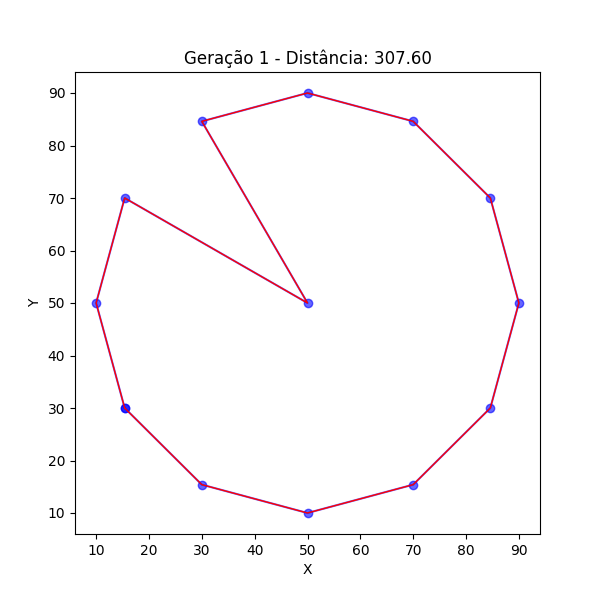
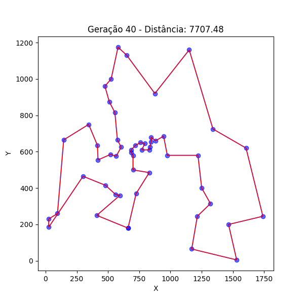
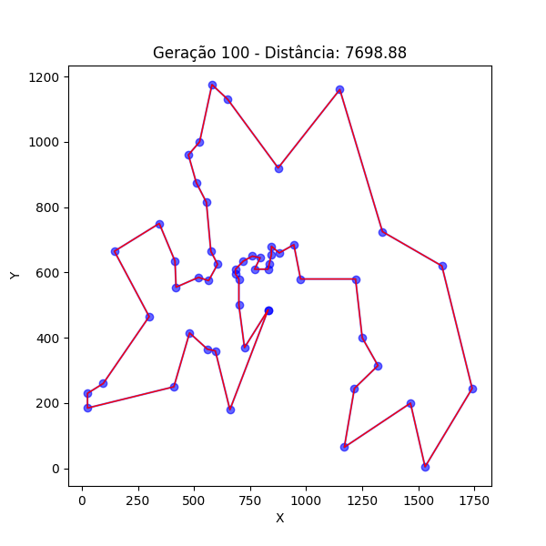
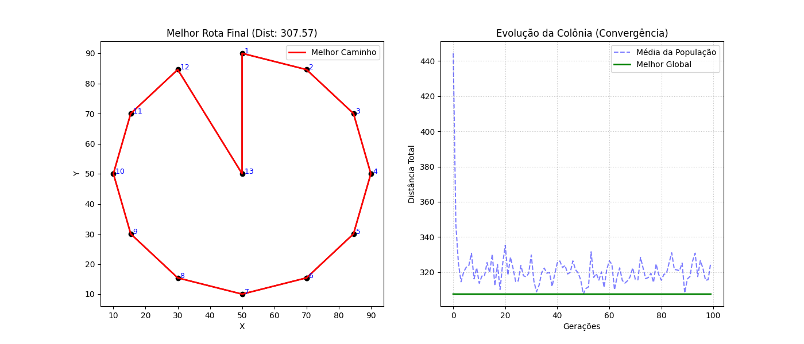

# Trabalho 02: Meta-heurística para Otimização Combinatória (ACO no TSP)

Este projeto implementa o algoritmo de **Otimização por Colônia de Formigas (Ant Colony Optimization - ACO)** para resolver o clássico **Problema do Caixeiro Viajante (Traveling Salesman Problem - TSP)**.

O trabalho foi desenvolvido em **Python** como requisito avaliativo da disciplina de Programação, demonstrando o uso de estruturas de dados avançadas (matrizes com NumPy), manipulação de arquivos e visualização de dados.

---

## 📑 Índice

1. [Sobre o Projeto](#-sobre-o-projeto)
2. [O Problema e o Cenário](#-o-problema-e-o-cenário-de-teste)
3. [Como o Algoritmo Funciona](#-como-o-algoritmo-funciona-didático)
4. [Resultados e Análise](#-resultados-e-análise)
5. [Estrutura de Arquivos](#-estrutura-de-arquivos)
6. [Como Rodar](#-como-rodar)
7. [Configuração](#️-configuração-e-parâmetros)
8. [Detalhes Técnicos](#-detalhes-técnicos-para-avaliação)
9. [Autor](#-autor)

---

## 📋 Sobre o Projeto

O objetivo é encontrar a rota mais curta possível que visita um conjunto de cidades e retorna à origem, um problema classificado como NP-Difícil. A implementação utiliza o **Ant System (AS)**, onde "formigas artificiais" constroem soluções baseadas em:
1.  **Visibilidade (Heurística):** Preferência por cidades mais próximas ($1/d_{ij}$).
2.  **Feromônio (Histórico):** Preferência por caminhos já utilizados com sucesso por outras formigas.

---

## 🧩 O Problema e o Cenário de Teste

### O Problema do Caixeiro Viajante (TSP)
O **Traveling Salesman Problem (TSP)** é um dos desafios mais estudados em otimização combinatória. O enunciado é simples, mas a resolução é complexa:

> *"Dado um conjunto de cidades e as distâncias entre cada par de cidades, qual é a rota mais curta possível que visita cada cidade exatamente uma vez e retorna à cidade de origem?"*

A complexidade cresce fatorialmente ($O(n!)$), tornando inviável o uso de força bruta para muitas cidades.

### O Dataset: Berlin52
Para validar o algoritmo, utilizamos a instância **`berlin52`** da biblioteca **TSPLIB**, uma coleção padrão de benchmarks acadêmicos.

<p align="center">
  
  <br>
  <em>Figura 1: Distribuição espacial das 52 cidades (coordenadas cartesianas).</em>
</p>

* **Desafio:** A distribuição irregular dos pontos (aglomerados densos e áreas esparsas) cria "armadilhas" (mínimos locais) que testam a capacidade do algoritmo de não estagnar.
* **Meta:** O melhor caminho conhecido (Ótimo Global) para este problema tem distância **7542**.

---

## 🐜 Como o Algoritmo Funciona (Didático)

O processo computacional segue três etapas principais inspiradas na natureza:

### 1. Construção da Solução (O Passeio Probabilístico)
Cada formiga inicia em uma cidade aleatória e constrói uma rota passo a passo. A decisão de qual cidade visitar em seguida baseia-se em uma probabilidade que combina o **Rastro de Feromônio ($\tau$)** (experiência coletiva) e a **Visibilidade ($\eta$)** (distância inversa).

### 2. O Feedback Positivo (Depósito de Feromônio)
Ao final de cada ciclo, as formigas depositam feromônio nos caminhos percorridos. A quantidade é **inversamente proporcional** à distância total: caminhos curtos recebem muito feromônio; caminhos longos recebem pouco.

### 3. A Evaporação (Esquecimento Estratégico)
Uma porcentagem do feromônio "evapora" a cada ciclo. Isso é crucial para evitar a **estagnação**, permitindo que caminhos antigos e ruins sejam esquecidos em favor de novas descobertas.

---

## 📊 Resultados e Análise

O algoritmo foi executado por 100 gerações com uma população de 52 formigas.

### 1. Evolução Topológica (Aprendizado Visual)
As imagens abaixo demonstram como a colônia "aprende" a rota ótima, eliminando cruzamentos ineficientes ao longo do tempo.

| Geração 1 (Início) | Geração 40 (Refinamento) | Geração 100 (Final) |
| :---: | :---: | :---: |
|  |  |  |
| *Exploração aleatória.* | *Forma definida, ajustes locais.* | *Rota otimizada.* |

### 2. Análise de Convergência
O gráfico abaixo ilustra a performance do algoritmo:

<p align="center">
  
</p>

* **Linha Verde (Melhor Global):** Mostra a queda rápida do custo nas primeiras gerações e a estabilização subsequente.
* **Linha Azul (Média da População):** A oscilação da média acima do melhor global indica que a colônia manteve a **diversidade genética**, continuando a explorar alternativas mesmo após encontrar uma boa solução.

**Performance Final:** O resultado obtido (~7698) aproxima-se do ótimo conhecido (7542) com uma margem de erro de apenas **~2%**, validando a eficácia da implementação.

---

## 📂 Estrutura de Arquivos

A organização do repositório contém o código, os dados e a documentação acadêmica (Artigo e Slides):

```text
trabalho-aco-tsp/
│
├── README.md               # Documentação do projeto (este arquivo)
│
├── artigo.pdf              # 📄 Artigo Científico (Entrega Oficial - Opção 1)
├── apresentacao.pdf        # 📽️ Slides para a Apresentação
│
├── input/
│   └── cidades.txt         # Dataset (Berlin52 - TSPLIB)
│
├── output/                 # Resultados gerados pelo algoritmo
│   ├── resultado.txt       # Relatório textual da melhor rota
│   ├── grafico_final.png   # Gráfico de Convergência
│   └── snap_geracao_*.png  # Snapshots da evolução
│
└── src/                    # Código Fonte Python
    ├── main.py             # Arquivo principal (Executar este arquivo)
    ├── aco.py              # Lógica da Colônia (AntColony)
    ├── graph.py            # Matrizes de Distância
    └── utils.py            # Funções de I/O e Gráficos

-----

## 🚀 Como Rodar

### 1\. Pré-requisitos

  * Python 3.8+
  * Bibliotecas: `numpy`, `matplotlib`

<!-- end list -->

```bash
pip install numpy matplotlib
```

### 2\. Execução

Execute o arquivo principal a partir da raiz do projeto:

```bash
python src/main.py
```

-----

## ⚙️ Configuração e Parâmetros

Os hiperparâmetros podem ser ajustados no arquivo `src/main.py`:

| Parâmetro | Valor Utilizado | Descrição |
| :--- | :--- | :--- |
| `NUM_FORMIGAS` | 52 | Agentes por geração ($m \approx n$). |
| `NUM_ITERACOES` | 100 | Ciclos de execução. |
| `ALFA` ($\alpha$) | 1.0 | Peso do Feromônio. |
| `BETA` ($\beta$) | 5.0 | Peso da Visibilidade. |
| `EVAPORACAO` | 0.5 | Taxa de evaporação (0.0 a 1.0). |

-----

## 🛠 Detalhes Técnicos (Para Avaliação)

Este trabalho atende aos requisitos do **Trabalho 02** da seguinte forma:

1.  **Tema:** Meta-heurística (ACO) em Problema de Otimização Combinatória (TSP).
2.  **Entrada de Dados:** Leitura robusta de arquivo texto (`utils.ler_cidades`).
3.  **Estruturas de Dados:** Uso intensivo de **Matrizes NumPy** para cálculos vetoriais, garantindo eficiência.
4.  **Saída de Dados:** Persistência dos resultados em arquivo `.txt` e geração de gráficos.
5.  **Qualidade de Código:** Código modularizado, tipado e comentado.

-----

## ✒️ Autor

**Michael Yoshiaki Todoroki**
*Curso de Engenharia de Computação - CEFET-MG*
*Disciplina de Programação - Novembro/2025*

